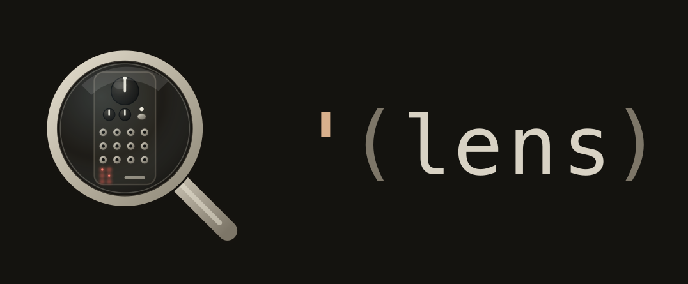

<p align="center">
  
</p>

# Lens

> **0.1 alpha.** Lens is early and shared so people can start playing with it,
> not as a finished release. Expect rough edges, patches that misbehave, and
> outright bugs. Loupe is a little language that lets you combine things in lots
> of ways, so testing every combination is more than I can do alone. Releasing
> early spreads the debugging across more hands. Please try it, report what you
> find, and share what you make.

Lens is a program card for the [Music Thing Workshop System
Computer](https://www.musicthing.co.uk/Computer_Program_Cards/). It turns the
card into a small programmable synth voice or effect: a generative voice, a
sequencer, a quantiser, a delay, a Turing machine, a drum kit, whatever you
wire up. You write patches in [Loupe](docs/loupe.md), a small
parens-and-S-expressions language. The compiler turns a patch into a flat
snapshot the card runs at 48 kHz.

A patch speaks CV, gates and audio at the six jacks, so the card plays well
with the rest of the Workshop System (or any rack, if you run the Computer
standalone).

**Try it in the browser:** [grsr.github.io/lens/web](https://grsr.github.io/lens/web/)
(Chrome or Edge, edit a patch and send it to the card over WebMIDI).

## A taste

A four-note minor arpeggio that steps once per beat. The voice comes out three
ways at once: pitch as v/oct on `cv-out-1`, a trigger on `pulse-out-1`, and a
sine you can hear directly on `audio-out-1`.

```lisp
(patch
  (def master (clock :tempo (knob :x)))
  (def melody (tape '(C3 Eb3 G3 Bb3)))

  (def voice  (step melody))
  (<- (cv-out :1)    (v-oct voice))
  (<- (pulse-out :1) (trig))
  (<- (audio-out :1) (sine voice)))
```

Knob X sets the tempo. `step` reads one cell of the tape per clock tick, `trig`
is a trigger pulse on each beat, `v-oct` turns a MIDI note into a pitch
voltage. Every word is documented in [docs/loupe.md](docs/loupe.md).

## Use it

The [web editor](https://grsr.github.io/lens/web/) is the easiest way in, and the
one most people will want. Open it in Chrome or Edge (WebMIDI is needed), connect,
pick an example from the dropdown, edit, and send it to the card. It can also save
the patch into the card's flash so it survives a power cycle.

For development and scripted flashing there is a Node CLI:

```sh
npm install
node cli/cli.js write patches/turing-machine.loupe          # send a patch
node cli/cli.js write patches/turing-machine.loupe --save   # send and save to flash
node cli/cli.js ping                                         # handshake
```

`node cli/cli.js --help` lists the rest. Holding the Z-switch down for a few
seconds also saves whatever patch is currently running into flash.

## Example patches

The patches in `patches/` are starting points, not a survey of the language.
Each opens with a few comment lines saying what it does, what the knobs control,
and what to patch where. Try `hello.loupe` (one sine, the knob picks the pitch)
and `turing-machine.loupe` (a note loop that slowly rewrites itself), then browse
the folder for the rest. The `patches/utility-pair/` subfolder holds small `fn`
library files (low-pass gate, wavefolder, sample-and-hold, slew, and more), a
homage to Chris Johnson's Utility-Pair card and a demo of the `(use)` style.

Lens leans into the generative and feedback-driven side of modular, but it
doesn't have to be used that way. It can just be a kick drum, an oscillator, a
filter, or any other single voice in your rack.

## Repo layout

```
compiler/   Loupe source -> snapshot pipeline (pure JavaScript)
runtime/    the C runtime, hardware shell (main.cpp), and snapshot decoder
cli/        dev CLI and sysex wire protocol
web/        the web editor (the primary user interface)
tools/      build helpers and lookup-table generators
patches/    example patches
docs/       this documentation
prelude.loupe   the standard library (every builtin and its kwargs)
CMakeLists.txt, pico_sdk_import.cmake, LICENSE, package.json
```

## Build from source

The repo ships a ready-built `lens.uf2`. To build it yourself you need the
Raspberry Pi [pico-sdk](https://github.com/raspberrypi/pico-sdk):

```sh
cmake -B build
cmake --build build -j
```

A fresh `lens.uf2` lands at the repo root. Flash it the same way you flash any
program card: with the module connected over USB, the card mounts as a USB
drive called `RPI-RP2`; copy `lens.uf2` onto it.

## Dig in

- [docs/loupe.md](docs/loupe.md): the Loupe language guide.
- [docs/developer_guide.md](docs/developer_guide.md): the compiler, the
  runtime, what runs where, and how to build and modify it.

## Acknowledgements

Lens stands on a pile of other people's work:

- **Chris Johnson** for `ComputerCard.h`, the C++ library that talks to the
  card's hardware, for the band-limited sawtooth used in the runtime, and for
  the Utility-Pair card the `patches/utility-pair/` folder is a homage to.
- **Vincent Maurer** for the ADC self-heal pattern inside `ComputerCard.h`,
  from his Grains card.
- **Émilie Gillet** and **Mutable Instruments** for Plaits, whose percussion
  voices inspired the kick, snare and hat.
- **Tom Whitwell** and **Music Thing Modular** for the Workshop System and the
  Computer card this runs on.
- **Raspberry Pi** for the [pico-sdk](https://github.com/raspberrypi/pico-sdk).

A lot of the hairier parts of the compiler and runtime were written with Claude
Code. The human assistant did his best to follow along, takes full
responsibility for the bugs, and admits he isn't 100% sure how some of it works.

This is a hobby project, so replies may be slow. If something breaks, please
open an issue with the patch text and what you expected. The card fails
amusingly more than dangerously, so it's usually safe to just try things. A PR
with a fix is as welcome as an issue.
